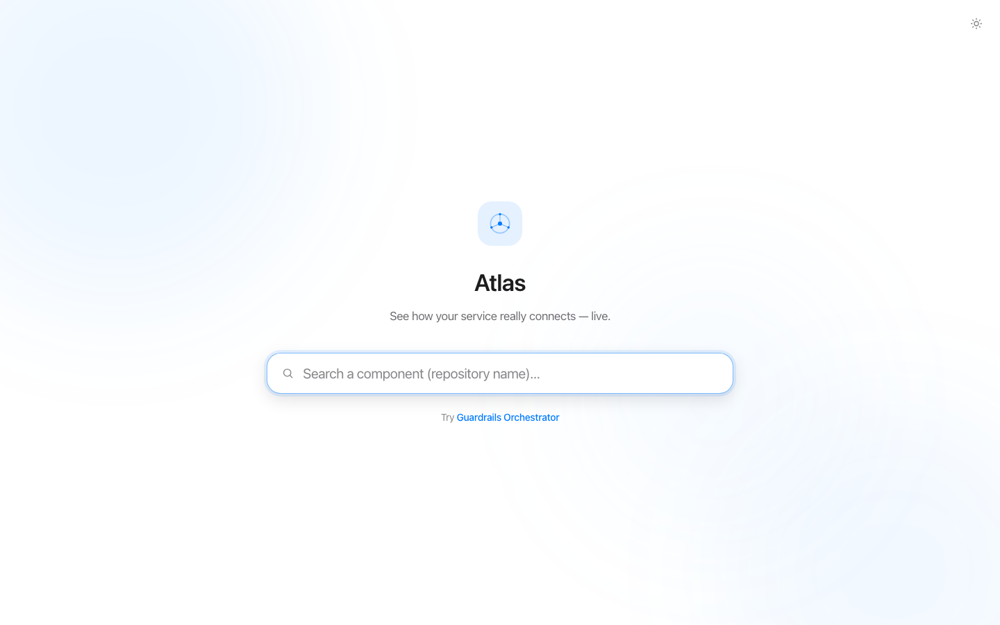
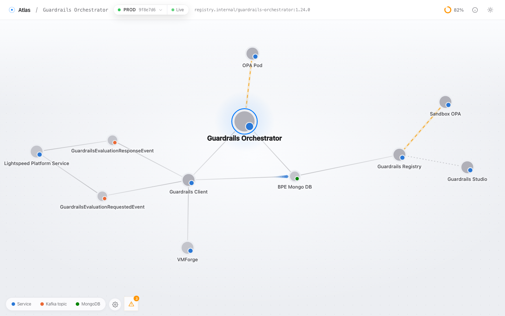
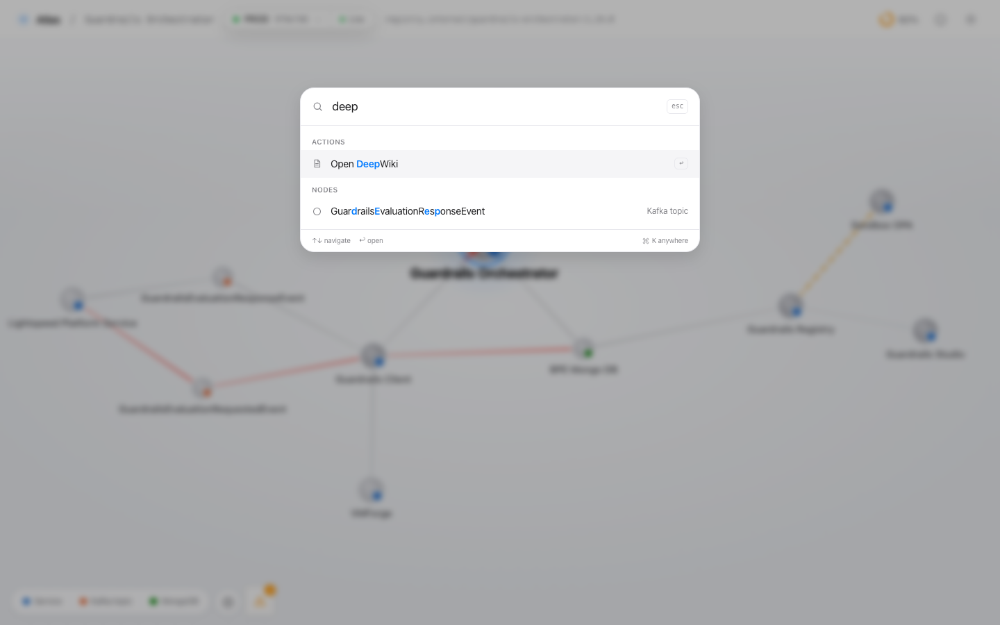
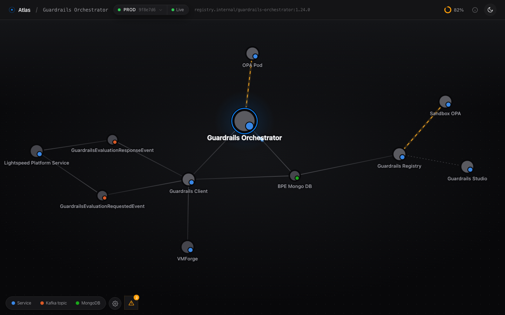

# Atlas — Service Dependency & Observability Dashboard

An Apple-inspired UI where an engineer searches for a **component** (a repository) and is greeted
with an elegant, force-directed **neural-network map** of its dependencies — who calls it, and what
it calls (services, Kafka, databases, Mongo, caches, external APIs). On top of the static map
(sourced from a Devin-generated **DeepWiki**) Atlas overlays **live data flow** from Splunk/SPLOC,
flags **"missing links"** (connectivity exists but no logs → misconfigured logging), lets you drill
into any **trace's logs**, and turns findings into action: generate a **HyperExecute synthetic test**
from a trace, or a **logging/alerting enhancement** for an owned repo.

> The backend is a real Spring WebFlux + hexagonal service, but every outbound adapter
> (DeepWiki, Splunk, SPLOC, Grafana, HyperExecute) returns deterministic **in-memory mock data** —
> nothing external is required to run or demo it.

## The experience

| | |
|---|---|
|  |  |
| Spotlight-style landing with ambient light | The living map — luminous nodes, comet-tail live flow, amber missing-link glow |
|  |  |
| ⌘K palette — jump to nodes, run actions, switch components | Dark mode with additive particle glow |

Signature details: an Apple-Watch-style **coverage ring** in the header animates to the logging-coverage
score; loading a map with logging gaps plays a one-shot **insight shimmer** on the amber edges; the
whole UI is a hand-rolled design system — 3 runtime dependencies, no component/icon/motion libraries.

---

## Architecture

```
Frontend (React 19 · Vite · TypeScript · Tailwind v4)      ── REST /v1/**  &  WS /ws/flow ──►
  Apple design system · react-force-graph neural map · live particle overlay
Backend (Spring Boot · WebFlux · hexagonal · reactive)
  inbound REST + WebSocket adapters → use cases → outbound ports
      └─ MockDeepWiki · MockSploc · MockSplunk · MockGrafana · MockHyperExecute · MockRepoEnhancement
```

**Core insight:** DeepWiki gives the *topology*; Splunk/SPLOC give *observed traffic + logs*. Atlas
**joins** them — an edge that exists in the map but has no logs is a **missing link**
(`MissingLinkDetector` + `HealthMapUseCase`). The headline **logging-coverage %** quantifies the gap.

### Backend layout (vertical-slice hexagonal, per slice)
`adapters/{inbound,outbound}` · `application` · `domain/dto` · `ports/{inbound,outbound}`

| Slice | Responsibility | Key endpoints |
|-------|----------------|---------------|
| `topology` | dependency graph, search, DeepWiki docs, Grafana metrics | `GET /v1/components/search`, `/{c}/graph`, `/{c}/nodes/{id}/wiki`, `/{c}/nodes/{id}/metrics` |
| `flow` | traces, logs, live flow feed | `GET /v1/traces`, `/v1/traces/{id}`, `WS /ws/flow?component=` |
| `insights` | topology↔observability join, coverage | `GET /v1/components/{c}/health-map` |
| `actions` | synthetic tests + repo enhancements | `POST /v1/synthetics/from-trace/{id}`, `POST /v1/enhancements/{c}` |

---

## Running

### Backend (port 8080)
```bash
cd backend
./mvnw spring-boot:run
```

### Frontend (port 3000, proxies /v1 and /ws to 8080)
```bash
cd frontend
npm install
npm run dev
```
Open http://localhost:3000.

### Standalone demo mode (no backend)
The frontend synthesizes all data locally, so a demo survives the backend being down:
```bash
cd frontend && npm run demo      # or just append ?demo to the URL
```

---

## Demo script (≈2 min)
1. **Land** on the search hero → type `checkout` → pick **checkout-service**.
2. The **neural map** settles; glowing **particles** flow along edges in real time.
3. Note the **logging coverage** dial (top-left) and click **Explain this map** for an AI-style
   narrative of the topology and its blind spots.
4. Open the **Missing links** panel (top-right) → click the amber **checkout-service → pricing-service**
   link; it highlights and pulses on the map.
5. Click **View traces** → open a trace → see the **waterfall**; the *pricing-service* and *stripe-api*
   spans show **no logs** (the missing link at trace granularity).
6. **Create synthetic test** → a ready-to-run **HyperExecute** spec.
7. Click the **checkout-service** node → **DeepWiki** tab for generated docs; **Metrics** tab for Grafana
   sparklines; **Blast radius** to highlight everything downstream; **Enhance logging** for a suggested diff.
8. Toggle **dark/light** — the Apple polish holds in both.

---

## Testing
```bash
cd backend && ./mvnw test
```
Covers the core join logic: `MissingLinkDetectorTest` (classification + coverage math),
`HealthMapUseCaseTest` (topology edge with no logs → `missing_logs`, coverage %), and
`FlowUseCaseTest` (Splunk logs merged into spans; gap spans marked `hasLogs=false`).

---

## Tech
- **Frontend:** React 19, Vite, TypeScript (strict), Tailwind v4, `react-force-graph-2d`.
- **Backend:** Java 21, Spring Boot / WebFlux, Lombok, reactive `Mono`/`Flux`, injected `Clock`.
# atlas-service
